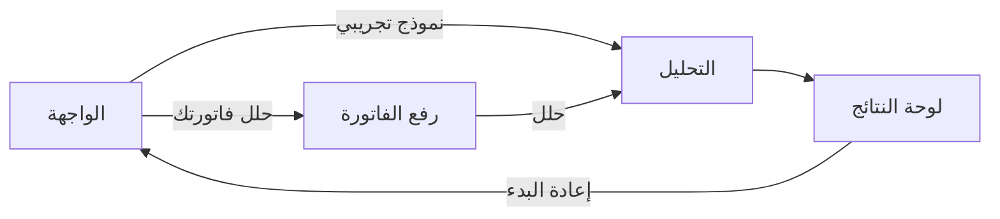
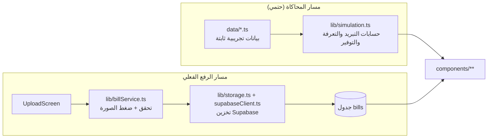

# البنية المعمارية — تدفق البيانات

نظرة سريعة على كيف تتحرك البيانات داخل رشيد، لمن يبدأ المساهمة لأول مرة. لهيكلة المجلدات الكاملة راجع [README](../README.md#البنية).

## حالة التطبيق (State Machine)

يدير `AppShell` مرحلة واحدة فقط للتطبيق كامل، بدون مكتبة إدارة حالة خارجية:

## مساران للبيانات

المشروع الآن فيه مساران يغذّيان الواجهة، وهذا مهم يفهمه أي مساهم جديد:

- **مسار المحاكاة**: `data/` بيانات تجريبية ثابتة → `lib/simulation.ts` يحسب كل الأرقام (التبريد، تسخين المياه، الفاتورة) في مكان واحد → المكوّنات تعرض النتيجة فقط. هذا المسار يغذّي حاليًا خطة رشيد ومحاكي «ماذا لو؟» وقسم المياه.
- **مسار الرفع والتحليل عبر الذكاء الاصطناعي**: `UploadScreen` يرفع الفاتورة ويحللها عبر Gemini Vision باستخدام عقد [مخطط JSON الموحّد](file:///Users/moad/.gemini/antigravity/worktrees/Rasheed-AI/fix_a13_package_resolution/docs/invoice-schema.md) (`docs/invoice-schema.json`) الموثّق في `/docs`. يتم التحقق من البيانات وتخزينها في جدولي `bills` و `bill_readings` عبر `lib/billService.ts`.

- **مسار المحاكاة**: `data/` بيانات تجريبية ثابتة → `lib/simulation.ts` يحسب كل الأرقام (التبريد، تسخين المياه، الفاتورة) في مكان واحد → المكوّنات تعرض النتيجة فقط. هذا المسار يغذّي حاليًا خطة رشيد ومحاكي «ماذا لو؟» وقسم المياه.

قاعدة صارمة على جميع المسارات: **لا قيم مكتوبة داخل الواجهات**. أي رقم جديد يمر عبر `data/` أو قاعدة البيانات، لا عبر ثوابت داخل مكوّن React.

## ماذا يتغيّر لاحقًا؟

هذه الطبقات مصمّمة لتُستبدل دون كسر الواجهات — راجع [Issues المستودع](https://github.com/Turki-Aldaajani/Rasheed-AI/issues) لتفاصيل كل مهمة ومعيار قبولها:

| الآن | لاحقًا |
| --- | --- |
| رفع وتحليل الفواتير موحّد بـ JSON Schema موثّق في `/docs` | دعم أنواع إضافية من الخدمات وتكامل التعرفة المتقدم |
| أرقام تعرفة وطقس ثابتة في `lib/simulation.ts` | Function Calling للتعرفة الرسمية والطقس الفعلي |
| لا مصادقة مستخدمين | Supabase Auth وربط الفواتير بحساب المستخدم |

## ملاحظة

المشروع في مرحلة نموذج أولي نشِط يتطوّر بسرعة على أكثر من فرع بالتوازي — إذا لاحظت أن هذا المستند لم يعد يطابق الكود، حدّثه ضمن أي PR ذي صلة بدل فتح مهمة منفصلة له.
