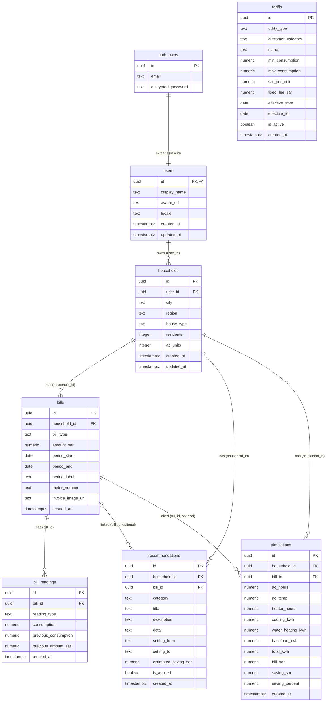

# Rasheed AI — Entity Relationship Diagram

> **Issue G1 · سكيما Supabase (بوابة)**
>
> This document describes the database schema powering Rasheed AI.
> All diagrams are Mermaid and stay in sync with `supabase/migrations/00001_create_schema.sql`.

## Ownership Model

Every piece of user data traces back to a single authenticated user through this chain:

```
auth.users  ──1:1──▸  public.users  ──1:N──▸  households
                                                  │
                                    ┌─────────────┼─────────────┐
                                    ▼             ▼             ▼
                                  bills    recommendations  simulations
                                    │
                                    ▼
                              bill_readings
```

**Row Level Security** enforces this chain: every query resolves to `auth.uid()` via the household's `user_id` column. Two SECURITY DEFINER helper functions in the **`private` schema** (`private.get_user_household_ids()`, `private.get_user_bill_ids()`) efficiently resolve the ownership chain without nested RLS evaluation. They live in `private` — not the API-exposed `public` schema — so they cannot be called directly via the Data API. Each uses `SET search_path = ''` and fully qualified object references to prevent search_path injection.

**Tariffs** are global reference data with no user ownership — authenticated users can read them, but only administrators (service_role) can modify them.

## ERD



## Table Details

### 1. `public.users`

Profile table extending `auth.users`. Linked 1:1 via shared UUID primary key. Does **not** store authentication secrets (email, password) — those live exclusively in `auth.users`.

| RLS | Rule |
|-----|------|
| SELECT | `id = auth.uid()` |
| INSERT | `id = auth.uid()` |
| UPDATE | `id = auth.uid()` (USING + WITH CHECK) |
| DELETE | No policy — cascades from `auth.users` deletion |

### 2. `public.households`

Household profiles. One user can own **multiple** households (1:N). This is the ownership root — bills, recommendations, and simulations all reference a household.

| RLS | Rule |
|-----|------|
| SELECT | `user_id = auth.uid()` |
| INSERT | `user_id = auth.uid()` |
| UPDATE | `user_id = auth.uid()` (USING + WITH CHECK prevents reassignment) |
| DELETE | `user_id = auth.uid()` |

### 3. `public.bills`

Electricity and water bills linked to a household. Supports both utility types via a `bill_type` check constraint.

| RLS | Rule |
|-----|------|
| All ops | `household_id IN (SELECT private.get_user_household_ids())` |

### 4. `public.bill_readings`

Per-bill consumption readings (kWh or m³) with optional previous-period comparison data.

| RLS | Rule |
|-----|------|
| All ops | `bill_id IN (SELECT private.get_user_bill_ids())` |

### 5. `public.tariffs`

Global reference data for tiered utility pricing. Multiple rows represent consumption bands (e.g., 0–2000 kWh @ rate A, 2001+ kWh @ rate B). `max_consumption` is NULL for open-ended top tiers.

**Not user-owned.** Managed by service_role/admin only.

| RLS | Rule |
|-----|------|
| SELECT | `true` (all authenticated users) |
| INSERT/UPDATE/DELETE | No policies — only service_role can modify |

### 6. `public.recommendations`

Personalized saving recommendations per household. Optionally linked to a specific bill.

| RLS | Rule |
|-----|------|
| All ops | `household_id IN (SELECT private.get_user_household_ids())` |

### 7. `public.simulations`

"What-if" simulation result snapshots storing both inputs (ac_hours, ac_temp, heater_hours) and computed outputs.

| RLS | Rule |
|-----|------|
| All ops | `household_id IN (SELECT private.get_user_household_ids())` |

## Indexes

| Table | Index | Columns |
|-------|-------|---------|
| households | `idx_households_user_id` | `user_id` |
| bills | `idx_bills_household_id` | `household_id` |
| bills | `idx_bills_household_type_period` | `household_id, bill_type, period_start` |
| bill_readings | `idx_bill_readings_bill_id` | `bill_id` |
| tariffs | `idx_tariffs_utility_active` | `utility_type, customer_category, is_active` |
| recommendations | `idx_recommendations_household_id` | `household_id` |
| simulations | `idx_simulations_household_id` | `household_id` |

## Helper Functions

| Function | Schema | Purpose | Security |
|----------|--------|---------|----------|
| `handle_updated_at()` | `public` | Auto-sets `updated_at` on row modification (trigger) | INVOKER |
| `get_user_household_ids()` | **`private`** | Returns household UUIDs owned by `auth.uid()` | SECURITY DEFINER, `SET search_path = ''` |
| `get_user_bill_ids()` | **`private`** | Returns bill UUIDs belonging to user's households | SECURITY DEFINER, `SET search_path = ''` |

The SECURITY DEFINER helpers live in the **`private` schema** (not API-exposed) and bypass RLS on intermediate tables to avoid nested policy evaluation. They are used in RLS policies for `bills`, `bill_readings`, `recommendations`, and `simulations`.

**Privilege model:** `EXECUTE` is revoked from `PUBLIC` and `anon`; granted only to `authenticated`. Functions accept no caller-supplied user ID — ownership is always derived from `auth.uid()`.
